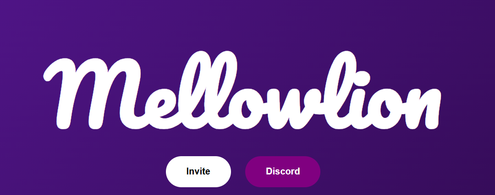

<h1 align="center">
  
  <br>
  Mellow Music
</h1>

<p align="center">
  
  
  
  
  
  
</p>

<h4 align="center">A Discord Music Bot</h4>

---

## Overview

**Mellow Music** is a Discord music bot built using the **discord.py** Python library.  
It is designed to enhance the music experience on Discord servers.

The bot is powered by:
- **Lavalink v4**
- **Wavelink v3**

---
## Repository Structure
```text
Mellow-Music/
│
├──  Cogs/
│   ├── 247.py
│   ├── autoplay.py
│   ├── delete_playlist.py
│   ├── disconnect.py
│   ├── help.py
│   ├── info.py
│   ├── invite.py
│   ├── join.py
│   ├── jump.py
│   ├── load_playlist.py
│   ├── loop.py
│   ├── pause.py
│   ├── player.py
│   ├── prefix.py
│   ├── queue.py
│   ├── resume.py
│   ├── saveplaylist.py
│   ├── shuffle.py
│   ├── skip.py
│   ├── stats.py
│   └── stop.py
│
├── Utils/
│   ├──  image.png
│   └──  requirements.txt
│
├──  Views/
│   ├──  __init__.py
│   └──  nowplayingview.py
│
├──.gitignore
├── Bot.py
└── README.md
```
## Commands

Mellow Music comes with a small but useful set of commands that users actually need.  
All commands are organized inside the `cogs` folder.

`.play`,`.pause`,`.resume`,`.skip`,`.autoplay`,`.loop`,`.shuffle`,`.saveplaylist`,`.loadplaylist`,`.removeplaylist` etc.

This command list may be updated in future.

# Wanna Test My Bot ?? 

You can test my bot on its official discord or visit it official website.

**Website Link** - https://mellow-bot-site.vercel.app/


**Official Discord Server**- https://discord.com/invite/xGJvT4SgrJ
